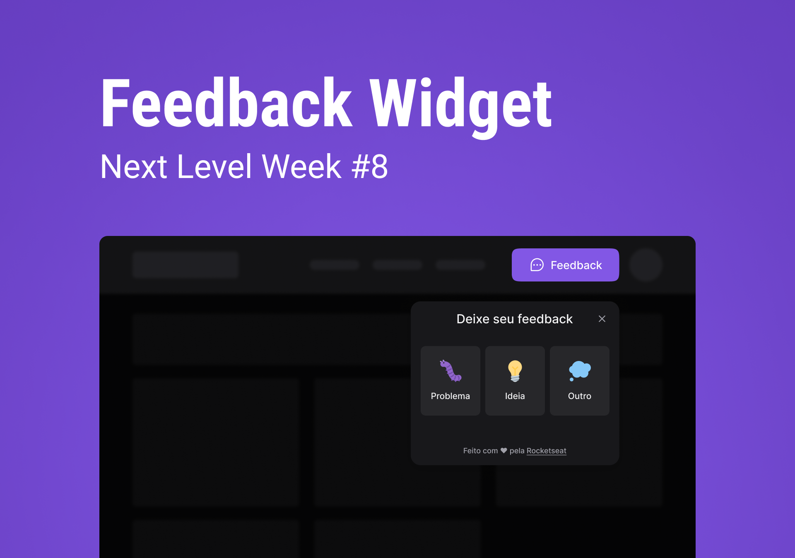

<h1 align="center">
    FeedGet 🚀
</h1>

	

## Aplicações

Por questões de organização as aplicações foram separadas em 3 repositorios(api, web, mobile)
Os links dos repositorios estão abaixo:

- [REST API](https://github.com/saymondamasio/feedget-api)
- [Web client](https://github.com/saymondamasio/feedget-web)
- [Mobile client](https://github.com/saymondamasio/feedget-mobile)

## 📝 License

This project is licensed under the MIT License - see the [LICENSE](LICENSE) file for details.

---

Made with 💜 &nbsp;by Elias Gabriel 👋 &nbsp;[See my linkedin](https://www.linkedin.com/in/saymondamasio/)
